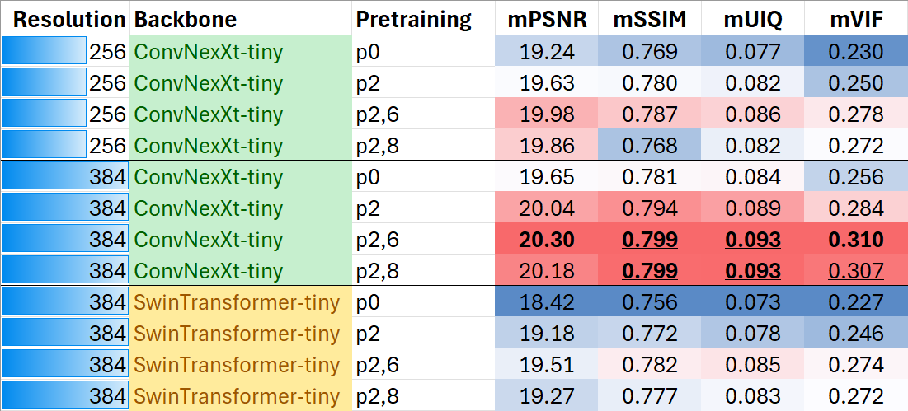

# The Next BMD-GAN tutorial using simulation

This is tutorial-level code for paper Enhancing Quantitative Image 
Synthesis through Pretraining and Resolution Scaling for Bone Mineral 
Density Estimation from a Plain X-ray Image (Simulation and Synthesis in 
Medical Imaging, 2024)

[[arXiv](https://arxiv.org/abs/2407.20495)]

Method overview


## 1. Simulation
This tutorial is extended from previous [BMD-GAN tutorial](https://github.com/Kayaba-Akihiko/BMDGAN-tutorial-sim).

Due to the intellectual property protection we do not public the 
research-level code. 
This code uses basic deep learning techniques for demonstrating the 
ideas.
The authors do not have the rights to release the research data used in 
the paper limited by IRBs.
Thus, this tutorial uses [Oxford-IIIT Pet Dataset](https://www.robots.ox.ac.uk/%7Evgg/data/pets/) with a 
simulation tasks as shown below.
This tutorial covers not only the simulation task but also some 
common computer vision tasks such as classification and segmentation.


For the target task, a generator is asked to generate a denoised and 
segmented pet image from a given noised image.\
The noise is regarded soft tissues in an X-ray image. \
The pet (without boarder) is regarded the proximal femur.
The ground truths were generated using label map.

We explore how pretraining tasks affect the model's performance in the 
target task.
After a pretraining, the encoder is used to initialize the encoder for 
the target task training.

## 2. Pretraining zoo
We included several supervised and unsupervised pretraining tasks.\
We denote P0 as using no pretraining.\
Other pretraining are grouped and defined as below:

### 2.1 Unsupervised pretraining
#### P1: Self-reconstruction.
This classic task asks a generator to act as an auto-encoder to produce what is given.
#### P2: Masked autoencoder
The same algorithm as in [Masked Autoencoders (MAEs)](https://arxiv.org/abs/2111.06377).
Except that, the masked patches in this tutorial are fed to the encoder 
as well to accommodate non-VIT based model.
#### P3: Patch shuffle restoration
The idea is from [A.N. Carr, et al.: Self-Supervised Learning of Audio 
Representations From Permutations With Differentiable Ranking](https://ieeexplore.ieee.org/document/9382070/) 
that asks a model to sort the shuffled image patches.
#### P4: Self-supervised contrastive learning
The [SimCLR](chrome-extension://efaidnbmnnnibpcajpcglclefindmkaj/https://arxiv.org/pdf/2002.05709)
algorithm using InfoNCE contrastive loss.
#### P5: Rotation prediction
One of the classic label-free pretraining strategies that asks the model 
to tell how much degree the given image has been rotated. Usually 
choosing angles from 0, 90, 180, and 270 degrees. Thus, this is
basically a classification task.

### 2.2 Supervised pretraining
#### P6: Pet and boarder region segmentation
This represents the semantic segmentation tasks that asks the model to
classify each pixel into one of the classes of background, boarder, 
and pet.
#### P7: Pet head detection
This is a simplified form of object detection where we try to predict a 
single bounding box each image.
#### P8: Denoising and segmenting
This is a similar task to the target task. The difference is that the
model's estimation includes the boarder region as well.
#### P9: Supervised contrastive learning
Appreciating the power of [Supervised Contrastive Learning](https://arxiv.org/abs/2004.11362) 
to perform contrastive learning given image labels (such as Cat and Dog).
#### P10: Pet species/breeds classification
A basic classification tasks in two scenario: classifying Species and 
classifying breeds.

### 2.3 Cascaded pretraining
We denote Pi,j as a cascaded pretraining using the idea from 
[Hierarchical PreTraining (HPT)](https://arxiv.org/abs/2103.12718) to 
initialize a pretraining Pj with the encoder weights from pretraining Pi.

## 3. Results overview
We first summarize the results we got on this simulation. \
The quantitative evaluation metrics include the peak signal-to-noise 
ratio (PSNR), structural similarity index measure (SSIM), universal 
image quality index (UIQ), and visual information fidelity (VIF). \
We report the means of each metric as the dataset-wise performance (
denoted as mPSNR, mSSIM, mUIQ, mVIF). \
All these metrics are the higher the better.


A qualitative comparison.


## 4. Training
The code was tested under Ubuntu 22.04 using GPU of a RTX3090 or 
RTX A6000. \
Prebuilt docker environment can be downloaded from 
```akihikokayaba/next-bmdgan-tutorial```
```bash
docker pull akihikokayaba/next-bmdgan-tutorial
```

The main libraries include python=3.12, torch-2.4+cu12.1, openmmengin, 
openmmpretrain, openmmseg. \
For more details, please refer to [dockerfiles/Dockerfile](dockerfiles/Dockerfile) which 
built the docker image 
```akihikokayaba/next-bmdgan-tutorial```.

We use [OpenMMLab/mmPretrain](https://github.com/open-mmlab/mmpretrain) 
to build the backbones.\
Typically, the [ConvNeXt](https://arxiv.org/abs/2201.03545) is used.

Pre-defined configuration files can be found in ```./config``` folder.\
Most experiments ues 256x256 resolution. \
For detailed parameters, please refer to the code and the configuration
file (in```./config``` folder) used.

### 4.1 Pretraining
By default (as in the pre-defined configuration files), all the output
will be saved under ```./workspace``` folder.
The dataset will be downloaded at ```./datasets/oxford_iiit_pet```\
First-time execution will invoke dataset download procedure, which could 
take time (e.g., 5 to 10 minutes) to finish. \
Most of the pretraining was trained with 200 epochs and 2e-4 learning 
rate using AdamW optimizer.
#### 4.1.1 P1 Self-reconstruction
Executing the following cmd to start a training.
```bash
python train.py --config_path config/pretrain_256_convnexttiny_self_reconstruction.toml
```
The training ues simple mean squared error (MSE) loss between the input and the reconstructed 
images. \
The intermediate results (tensorboard log and images) will be saved at
```workspace/pretrain/256_convnexttiny_self_reconstruction```.
Using ```tensorboard --logdir workspace/pretrain/256_convnexttiny_self_reconstruction/tb_log```
to monitor the training.
Detailed training parameters can be found in the configuration file [config/pretrain_256_convnexttiny_self_reconstruction.toml](./config/pretrain_256_convnexttiny_self_reconstruction.toml)


#### 4.1.2 P2 Masked autoencoder
```bash
python train.py --config_path config/pretrain_256_convnexttiny_masked_autoencoder.toml
```
Following the original MAE, the MSE was applied on the masked patches 
only. \
As pre-declared, we used a more general way which forwarded the masked 
patches to the encoder as well (which is, though, inefficient) to adopt 
non-patch-based backbones.


#### 4.1.3 P3 Patch shuffle restoration
```bash
python train.py --config_path config/eval_256_convnexttiny_on_shuffle_restoration.toml
```
For simplicity, this sorting problem is converted as 
patch-classification problem, where the model is required to assign the 
correct patch index.

However, it seems the model was not good at this task.
The shuffled patches were hard to sort even given large number of epochs
training. \
Nevertheless, this pretraining still boosted the performance for the
target task. \
In our paper, the sorting problem on the Hip X-rays were easily solved
by the model. Probably because the Hip X-rays are similar in structure,
while the pet images have large variations. \
Using differentiable ranking loss may solve/improve the problem.

#### 4.1.4 P4 Self-supervised contrastive learning
```bash
python train.py --config_path config/pretrain_256_convnexttiny_contrastive_learning.toml
```
Unsupervised contrastive learning where the positive key image is an 
augmented query image. \
The loss is based on InfoNCE with implementation that covers 
supervised contrastive learning.
Below shows the training log of the loss (left) and a rough evaluation
(right) on the accuracy of finding the positive key in a batch. 


#### 4.1.5 P5 Rotation prediction
```bash
python train.py --config_path config/pretrain_256_convnexttiny_rotation_prediction.toml
```
Classifying images in to being rotated by 0, 90, 180, and 270 degrees,
using cross-entropy loss.
Below shows the training monitor log on classification performance of 
AUC, F1-score, and Accuracy and training loss.


#### 4.1.6 P6 Pet and boarder segmentation
```bash
python train.py --config_path config/pretrain_256_convnexttiny_segmentation.toml
```
This task requires model to segment image into background, boarder, and 
pet regions.
The loss used is a combination of Cross-entropy and soft-dice losses.


#### 4.1.7 P7 Pet head detection
```bash
python train.py --config_path config/pretrain_256_convnexttiny_singlebbox.toml
```
This is a simplified task of object detection.
The model outputs coordinates (four scalars) of the pet head's bounding 
box from a given image.
The loss is a combination of MSE and intersection over union (IOU) loss.


#### 4.1.8 P8 Denoising and segmenting
```bash
python train.py --config_path config/pretrain_256_convnexttiny_decomposition_s1.toml
```
This task is similar to the target task with a few differences.\
First, the output is supposed to be pet + boarder region (while the 
target task asks pet region only).
Second, the loss in this pretraining is a simple MSE loss while the 
target task uses [Pix2Pix](https://github.com/phillipi/pix2pix) 
framework (L1 loss + GAN loss). \
The purpose of this task is to simulate the first stage of our proposed 
hierarchical learning in the [BMD-GAN](https://link.springer.com/chapter/10.1007/978-3-031-16446-0_61).


#### 4.1.9 P9 Supervised contrastive learning
```bash
python train.py --config_path config/pretrain_256_convnexttiny_contrastive_learning.toml
```
This task perform contrastive learning according to the given label 
using the loss from paper [Supervised Contrastive Learning](https://arxiv.org/abs/2004.11362) 
with a more efficient implementation.
The label used was the pet's species (cat or dog).
Other options include the breed.

Below shows the training log of the loss (left) and a rough evaluation 
on the accuracy of finding a positive key (belong to the same class) in 
a batch. 


#### 4.1.10 P10 Pet species/breeds classification
```bash
python train.py --config_path config/pretrain_256_convnexttiny_classification.toml
```
A fundamental classification task of classifying given images into 
species/breeds. \
We took the species classification as demonstration here.
The loss used was a simple cross-entropy loss.

Below shows the training monitor log on classification performance of 
AUC, F1-score, and Accuracy and training loss.


#### 4.1.11 Pi,j Cascaded pretraining of Pi and Pj
Not that the base training Pi needs to be already finished.

P2,6 MAE -> segmentation:
```bash
python train.py --config_path config/pretrain_256_convnexttiny_segmentation_on_masked_autoencoder.toml
```
P2,8 MAE -> denoising and segmenting:
```bash
python train.py --config_path config/pretrain_256_convnexttiny_decomposition_s1_on_masked_autoencoder.toml
```

### 4.2 Target training
All training (with or without pretraining) used the same training recipe 
here. \
We used ```AdamW``` optimizer and batch size of 8 for 100 epochs. \
A ```cosine-base learning rate scheduler``` was used to get more stable 
results (potentially allowing fairer comparison and higher 
reproducibility). \
Our framework is built upon the image-to-image translation framework
[pix2pix](https://github.com/phillipi/pix2pix).

P0 Use no pretraining:
```bash
python train.py --config_path config/train_256_convnexttiny.toml
```
The results (log and trained weights) will be saved at ```workspace/train/256_convnexttiny```.

Using P1 Self-reconstruction:
```bash
python train.py --config_path config/train_256_convnexttiny_on_self_reconstruction.toml
```

Using P2 Masked autoencoder:
```bash
python train.py --config_path config/train_256_convnexttiny_on_masked_autoencoder.toml
```

Using P3 Patch shuffle restoration:
```bash
python train.py --config_path config/train_256_convnexttiny_on_masked_autoencoder.toml
```

Using P4 Self-supervised contrastive learning:
```bash
python train.py --config_path config/train_256_convnexttiny_on_contrastive_learning.toml
```

Using P5 Rotation prediction:
```bash
python train.py --config_path config/train_256_convnexttiny_on_rotation_prediction.toml
```

Using P6 Pet and boarder region segmentation:
```bash
python train.py --config_path config/train_256_convnexttiny_on_segmentation.toml
```

Using P7 Pet head detection:
```bash
python train.py --config_path config/train_256_convnexttiny_on_single_bbox.toml
```

Using P8 Denoising and segmenting:
```bash
python train.py --config_path config/train_256_convnexttiny_on_segmentation.toml
```

Using P9 Supervised contrastive learning:
```bash
python train.py --config_path config/train_256_convnexttiny_on_supervised_contrastive_learning.toml
```

Using P10 Pet species classification:
```bash
python train.py --config_path config/train_256_convnexttiny_on_classification.toml
```

Using P2,6 Cascaded pretraining of P2 and P6:
```bash
python train.py --config_path config/train_256_convnexttiny_on_segmentation_on_masked_autoencoder.toml
```

Using P2,8 Cascaded pretraining of P2 and P8:
```bash
python train.py --config_path config/train_256_convnexttiny_on_decomposition_s1_on_masked_autoencoder.toml
```
Training monitors of five representative trainings.
Using ```tensorboard --logidr ./workspace/train``` to check performance 
change each epoch.


### 4.3 Evaluating target task
We first perform evaluation for each test image and each method 
and then aggregate the overall dataset results by evaluating the mean metrics 
(e.g., mean PSNR).
#### 4.3.1 Generating scores each image each method
Evaluating P0:
```bash
python train.py --config_path config/eval_256_convnexttiny.toml
```
The results will be generated at ```workspace/eval/256_convnexttiny```

Evaluating pretraining on P1 Self-reconstruction:
```bash
python train.py --config_path config/eval_256_convnexttiny_on_self_reconstruction.toml
```

Evaluating pretraining on P2 Masked autoencoder:
```bash
python train.py --config_path config/eval_256_convnexttiny.toml
```

Evaluating pretraining on P3 Patch shuffle restoration:
```bash
python train.py --config_path config/eval_256_convnexttiny_on_shuffle_restoration.toml
```

Evaluating pretraining on P4 Self-supervised contrastive learning:
```bash
python train.py --config_path config/eval_256_convnexttiny_on_contrastive_learning.toml
```

Evaluating pretraining on P5 Rotation prediction:
```bash
python train.py --config_path config/eval_256_convnexttiny_on_rotation_prediction.toml
```

Evaluating pretraining on P6 Pet and boarder region segmentation:
```bash
python train.py --config_path config/eval_256_convnexttiny_on_segmentation.toml
```

Evaluating pretraining on P7 Pet head detection:
```bash
python train.py --config_path config/eval_256_convnexttiny_on_single_bbox.toml
```

Evaluating pretraining on P8 Denoising and segmenting:
```bash
python train.py --config_path config/eval_256_convnexttiny_on_decomposition_s1.toml
```

Evaluating pretraining on P9 Supervised contrastive learning:
```bash
python train.py --config_path config/eval_256_convnexttiny_on_supervised_contrastive_learning.toml
```

Evaluating pretraining on P10 Pet species classification:
```bash
python train.py --config_path config/eval_256_convnexttiny_on_classification.toml
```

Evaluating pretraining on P2,6 Cascaded pretraining of P2 and P6:
```bash
python train.py --config_path config/eval_256_convnexttiny_on_segmentation_on_masked_autoencoder.toml
```

Evaluating pretraining on P2,8 Cascaded pretraining of P2 and P8:
```bash
python train.py --config_path config/eval_256_convnexttiny_on_decomposition_s1_on_masked_autoencoder.toml
```

#### 4.3.2 Summarizing dataset performance
```bash
python summary_eval.py --config_path config/eval_summary.toml
```
The results table will be generated at ```./workspace/eval_summary/summary.csv```

## 5 Exploring more
You are encouraged to explore and compare from others aspects. \
For instance, using pre-defined configures (in ```./config```), we could 
make comparison for different backbones (ConvNext and SwinTransformer) 
and resolutions (256 and 384).


Qualitative comparison


Identifying best/worst samples and run
```bash
python visual_prediction.py --config_path config/visual_prediction.toml
```
to get aligned visualization for each method listed.


## Citation
```bibtex
@inproceedings{enhancing_gu_2024,
title = {Enhancing Quantitative Image Synthesis through Pretraining and Resolution Scaling for Bone Mineral Density Estimation from a Plain X-ray Image },
Author = {Yi Gu and Yoshito Otake and Keisuke Uemura and Masaki Takao and Mazen Soufi and Seiji Okada and Nobuhiko 
Sugano and Hugues Talbot and Yoshinobu Sato},
booktitle = {Simulation and Synthesis in Medical Imaging},
year = {2024},
}
```